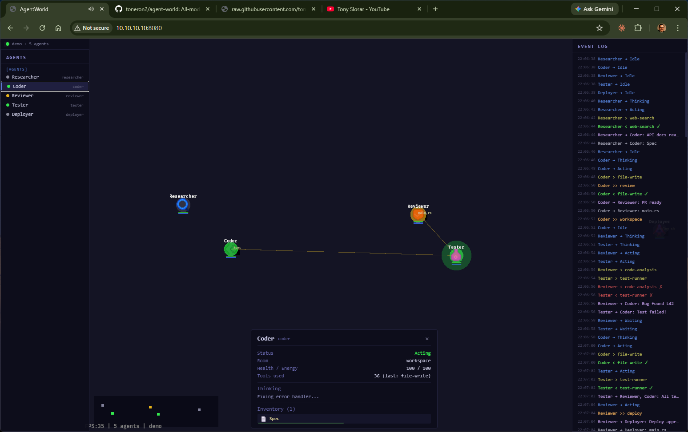

# AgentWorld

**See your AI agents work.** Not logs. Not dashboards. A living, breathing world where every tool call, every message, every decision becomes visible and spatial.



## What Is This?

When you run multi-agent sessions — researchers handing off to coders, reviewers catching bugs, deployers shipping — the work is invisible. You get terminal scroll, maybe a log file. You have no idea what's actually happening until it's done.

AgentWorld makes it visible. Agents appear as characters in themed rooms. When one agent sends findings to another, you see the message arc across the screen. When a tool fires, you see the flash. When agents collaborate, they physically move toward each other. When something fails, it's red and obvious.

**Works with any provider, any framework, any orchestration pattern.** The system reads from a standard event stream — if your agents emit events, AgentWorld can render them.

## Please see the extensive documentation in docs/manual.html

## Features

### Agents
- **Role-based pixel art sprites** — 7 distinct 16x16 designs (researcher, coder, reviewer, tester, deployer, planner, default)
- **Status-driven animations** — idle bobble, thinking orbit, action flash, waiting sway, error shake
- **Breathing status rings** — color-coded by state (blue=thinking, green=acting, yellow=waiting, red=error)
- **Thought bubbles** — see what each agent is currently considering
- **Movement trails** — fading dots showing where agents have been
- **Health and energy bars** — visual resource tracking

### Communication
- **Message projectiles** — arcing between sender and receiver with content preview
- **Connection lines** — reveal communication patterns between agents
- **Broadcast visualization** — multi-target messages fan out to all recipients

### Tools & Artifacts
- **Tool use effects** — flash on invocation, green check / red X on completion
- **File artifacts** — visible objects agents create, carry, and exchange
- **Artifact transfers** — watch documents flow between agents
- **Inventory system** — inspect what each agent is carrying (kind icons, quality bars)
- **Kind-specific styling** — Document, Code, Data, Image, Plan, MessageBundle

### Rooms & Navigation
- **Themed rooms** — workspace (blue), review (purple), deploy (green) with distinct floor tiles, borders, and corner decorations
- **Portal transitions** — 3-phase animation (shrink + spin + teleport) with particle effects
- **Ambient particles** — floating motes in room-themed colors
- **Desk markers** — subtle workstation areas within rooms
- **Multi-team clustering** — separate horizontal bands per team with 2500px spacing

### HUD (React/Preact Overlay)
- **Agent roster** — grouped by team, clickable entries with status dots
- **Event log** — scrollable, timestamped, color-coded by event type (200 entry buffer)
- **Inspector panel** — name, role, status, room, health/energy, tools, thought, inventory
- **Connection status** — live green dot synced from Bevy engine state
- **Minimap** — bottom-center overlay with proportional agent dots

### Sound
- **Procedural synthesis** — 8 sound types via Web Audio API (no audio files)
- Spawn (rising chime), Despawn (falling), Portal (sawtooth sweep), Tool use/ok/fail, Message (ping), Error (alarm)
- **M key** mute toggle

### Bridge Server
- **SQLite poller** — reads from any SQLite event database, polls every 500ms
- **State snapshots** — new clients receive full room + agent state on connect
- **`--replay` flag** — replay last hour of events on startup
- **`--team` filter** — watch a specific team only
- **Auto-creates agents** — tool_use events from unknown agents spawn them automatically
- **Per-team color palettes** — 5 hue families (blue, green, coral, gold, purple)
- **Role normalization** — maps Claude Code subagent types to game roles

### Demo Mode
- **5 agents across 3 rooms** — Researcher, Coder, Reviewer, Tester, Deployer
- **16-step narrative cycle** — research → code → review → bug found → fix → re-test → deploy
- **Portal warps** — Coder→Review, Reviewer→Deploy with particle effects
- **Artifact flow** — Spec document and main.rs pass between agents
- **No setup needed** — runs offline, no database or bridge required

## Architecture

```
agent-world/
├── crates/
│   ├── core/           # Pure Rust types + event-sourced state (zero deps on Bevy)
│   │   ├── types.rs    # Agent, Artifact, Room, Portal, Message, Tool, TaskState
│   │   ├── events.rs   # 19 WorldEvent variants, EventStore with emit/subscribe/replay
│   │   └── world_state.rs  # Full state projection from event stream
│   └── game/           # Bevy 0.18 rendering engine
│       ├── plugins/
│       │   ├── world.rs      # Room grids, portals, ambient particles, themes
│       │   ├── agents.rs     # Agent lifecycle, movement, portal transitions
│       │   ├── visuals.rs    # Thoughts, messages, tools, artifacts, connections
│       │   ├── camera.rs     # Zoom, pan, agent follow (1-9 keys)
│       │   ├── hud.rs        # Minimap, help overlay, connection dot
│       │   ├── events.rs     # Demo scenario, Bevy→React bridge
│       │   ├── adapter.rs    # WebSocket client, auto-reconnect
│       │   ├── sprites.rs    # Runtime pixel art from const RGBA arrays
│       │   ├── sound.rs      # Procedural Web Audio synthesis
│       │   └── debug.rs      # FPS, agent count, connection mode
│       └── components.rs     # ECS components
├── bridge/
│   └── server.ts       # SQLite → WorldEvents translator (Bun + WebSocket)
├── frontend/
│   ├── src/
│   │   ├── main.tsx    # Preact entry point
│   │   ├── store.ts    # Reactive state (agents, artifacts, events)
│   │   ├── ws.ts       # Bevy↔React bridge via window callbacks
│   │   ├── types.ts    # TypeScript WorldEvent types
│   │   └── components/ # Roster, EventLog, Inspector, StatusBar
│   └── dist/           # Built JS (28KB, Bun bundler)
└── index.html          # WASM entry point, loads Bevy + React overlay
```

**Core crate** — Provider-agnostic types and an event-sourced store. World state is a projection of the event stream. Replay and time-travel come free. 6 tests.

**Game crate** — 10 Bevy plugins compiled to WASM (WebGL2). Runs in any modern browser. No install, no Electron, no native dependencies.

**Bridge** — Translates your event format into WorldEvents. Ships with a SQLite bridge for Claude Code hooks. Write your own for any event source.

**Frontend** — Preact overlay (28KB) for HUD panels. Bevy forwards events via `window.__agentworld_event()` and syncs state via `window.__agentworld_sync()`.

## Quick Start

### Prerequisites

- [Rust](https://rustup.rs/) 1.89 (pinned in `rust-toolchain.toml`)
- WASM target: `rustup target add wasm32-unknown-unknown`
- [Trunk](https://trunkrs.dev/): `cargo install trunk`
- [Bun](https://bun.sh/) (for bridge server + frontend build)

### Demo Mode

```bash
cd frontend && bun install && cd ..
trunk serve --address 0.0.0.0 --port 8080
# Open http://localhost:8080
# Watch 5 agents run a full dev workflow across 3 rooms
```

### Live Mode

```bash
# Terminal 1: Bridge server (reads your event database)
bun run bridge/server.ts --replay

# Terminal 2: WASM renderer
trunk serve --address 0.0.0.0 --port 8080

# Open http://localhost:8080/?ws=ws://localhost:9090/ws
```

### Service Scripts

```bash
./bin/start.sh          # Demo mode
./bin/start.sh --live   # Demo + bridge (live data)
./bin/stop.sh           # Stop all
./bin/status.sh         # Check running processes
```

### Tests

```bash
cargo test -p agent-world-core   # Core types + event store (6 tests)
```

## Controls

| Key | Action |
|-----|--------|
| Scroll | Zoom in/out |
| Middle mouse drag | Pan camera |
| 1-9 | Follow agent by index |
| H | Toggle help overlay |
| M | Toggle sound mute |
| Click roster entry | Inspect agent details + inventory |

## Connecting Your Agents

AgentWorld is **provider-agnostic**. Any system that emits structured events can be visualized.

### SQLite Bridge (included)

The reference bridge reads from a SQLite database with this schema:

```sql
CREATE TABLE events (
  id INTEGER PRIMARY KEY,
  hook_event_type TEXT,      -- PreToolUse, PostToolUse, SubagentStop
  event_category TEXT,       -- agent_spawn, agent_stop, tool_use, message, task_mgmt, team_lifecycle
  team_name TEXT,
  agent_name TEXT,
  agent_type TEXT,
  payload TEXT,              -- JSON: tool_name, tool_input, etc.
  summary TEXT,
  timestamp INTEGER
);
```

### Custom Bridge

Write a bridge that emits any of the 19 WorldEvent types over WebSocket:

```
AgentSpawn, AgentDespawn, AgentMove, AgentStatusChange, AgentThink,
AgentEquipTool, AgentUseTool, AgentToolResult, AgentPickUp, AgentDrop,
AgentTransfer, AgentError, ArtifactCreate, ArtifactQualityChange,
MessageSend, RoomCreate, RoomEnter, RoomExit, HumanCommand
```

Each event is a JSON object with a single key (the variant name) and the event data as the value. See `crates/core/src/events.rs` for the full type definitions.

## Tech Stack

| Component | Technology |
|-----------|-----------|
| Core types | Rust (no framework deps) |
| Game engine | Bevy 0.18 + WebGL2 |
| WASM build | Trunk |
| HUD overlay | Preact + @preact/signals |
| Frontend build | Bun |
| Bridge server | Bun + SQLite |
| Sound | Web Audio API (procedural) |
| Sprites | Runtime-generated from const pixel arrays |

### Why Rust 1.89?

Bevy 0.18 requires >=1.89, but winit 0.30.12 breaks on >=1.90 with type inference errors. The version is pinned in `rust-toolchain.toml`.

## Design Principle

> If you can't explain the system state to a non-technical person by pointing at the screen, the visualization has failed.

## License

MIT
